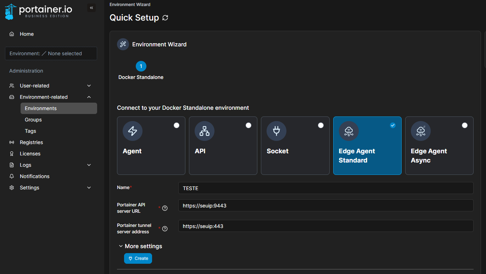

## Subindo o Portainer e Portainer Agent com ssl para Docker e Socker Swarm

# Criando a chave ssl auto-assinada e fazendo funcionar

Crie o **seu** certificado com open ssl utilizando o arquivo ´cert.conf´ dentro da pasta certs com o seguindo comando:

```
openssl req -x509 -nodes -days 365 -newkey rsa:2048 \
  -keyout portainer.key \
  -out portainer.crt \
  -config cert.conf \
  -extensions req_ext

```
**OBS.: os certificados presentes no repositório são meramente ilustrativos.**

Comando para verificar o SAN do certificado:

```
openssl x509 -in portainer.crt -text -noout | grep -A10 "Subject Alternative Name"
```

pega o .crt e joga pra pasta certs do agent e renomeia para "ca-certificates.crt" mapeando o volume no yml do agent:

```
- ./certs/ca-certificates.crt:/etc/ssl/certs/ca-certificates.crt:ro
```

# Subindo o portainer
É necessário criar o volume.

```
docker volume create portainer_data
```

# Gato do pulo pra portainer com ssl

Após subir o nginx para redirecionamento do túnel configure o túnel para conexão do nginx;


